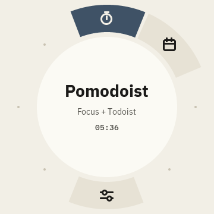
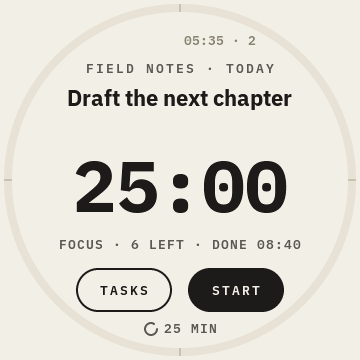
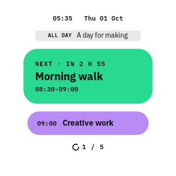
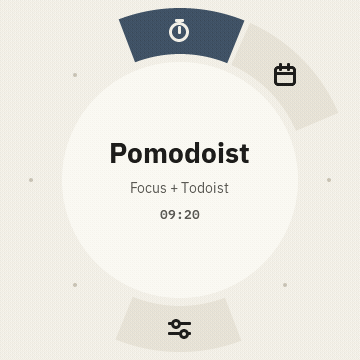

# TrevOS for ESP32-S3 Knob

**A desk focus dial: TrevOS, Pomodoist and Cal, open to build and make your own.**

An ESP-IDF / LVGL firmware project targeting the **Waveshare ESP32-S3-Knob-Touch-LCD-1.8 hardware family**: a 360 × 360 round touchscreen, rotary wheel and haptics. TrevOS provides the launcher, settings and shared services. Pomodoist connects a focus timer to Todoist. Cal puts Google Calendar on the desk. Each app has its own folder and documented dependencies.

**Status: experimental MVP.** The original firmware has run on hardware; this public extraction is a new source layout and needs its own hardware verification. Do not mistake passing desktop tests for a completed endurance or recovery test. Read the [hardware compatibility notes](docs/hardware.md) before buying or flashing a board.

## Choose what you want to build

| Goal | Start here | What you need |
|---|---|---|
| Complete focus puck | [Setup](docs/setup.md), [board project](boards/esp32-s3-knob/) | Matching ESP32-S3 hardware, ESP-IDF, your own credentials |
| Reuse Pomodoist | [Pomodoist](apps/pomodoist/README.md) | Portable timer core; optional sync and TrevOS UI |
| Reuse Cal | [Cal](apps/cal/README.md) | Calendar model; optional sync and TrevOS UI |
| Build another TrevOS app | [Architecture](docs/architecture.md), [examples](examples/) | LVGL display integration and the TrevOS app contract |
| Reuse the visual language | [Design system](DESIGN.md) | Tokens, IBM Plex fonts, round-screen layout and motion rules |

```sh
git clone https://github.com/Tr3v0r86/trevos-esp32-s3-knob.git
cd trevos-esp32-s3-knob
```

The repository is the development home for all three products. A folder is a module, not a promise of a zero-dependency application. See the module READMEs for the shared runtime and build requirements. There is no required private repository, hosted project backend, or paid TrevOS service.

## What it does

- **TrevOS:** wheel-driven ring launcher, touch navigation, brightness and idle settings, haptic feedback and explicit clock trust.
- **Pomodoist:** select a Todoist task, set a focus interval with the wheel, run/pause/reset, take a break, and queue focus-session comments for later delivery when offline.
- **Cal:** browse calendar events one detent at a time, inspect details, cache a calendar window, and signal upcoming timed events when the clock is trusted.

Pomodoist operates independently from Cal. Calendar events do not shorten or prevent a focus session. The device helps keep chosen work visible; it does not decide whether a task fits your plan.

| TrevOS launcher | Pomodoist | Cal |
|---|---|---|
|  |  |  |

These are actual simulator renders with invented content, not photographs of a device.



Wheel navigation, captured in the LVGL simulator with synthetic data. This is not hardware footage.

The first release retains the calendar model's **Asia/Bangkok / UTC+7 assumption**. It does not claim global timezone or daylight-saving support. Wi-Fi and integration credentials are configured at build time, not through a captive portal. Battery percentage and audio co-processor support are not part of this release.

## Build, preview and reuse

Follow [setup](docs/setup.md) for the clean build, simulator, account setup and safe flashing procedure. [Architecture](docs/architecture.md) explains module boundaries; [contributing](CONTRIBUTING.md) describes tests and the review/release workflow. Examples and module bundles are for reuse with their listed dependencies, not standalone phone or desktop apps.

```
os/                       TrevOS and shared network/time services
apps/pomodoist/            timer core, Todoist sync and UI
apps/cal/                 calendar model, sync and UI
boards/esp32-s3-knob/      complete firmware and hardware support
design/                   visual references and media
examples/                 minimal integration examples
sim/                      desktop LVGL simulator
tools/                    checks, packaging and device tooling
```

## Why a device on the desk?

Checking a task on a laptop or phone opens the same surface as everything competing with it. A small physical dial gives that check a place of its own. Turn to choose, tap to begin, and leave the next useful thing in view. Read [the philosophy](docs/philosophy.md) or visit [the project collection](https://trevorcardozo.com/work/trevos/).

Public screens use synthetic content. Product and desk renders are labelled concepts, not photographs or dimensionally verified CAD. [Media provenance](docs/media-provenance.md) distinguishes the evidence.

## License and project status

Original project code and documentation are [MIT licensed](LICENSE). Third-party fonts, dependencies and adapted driver material retain their licenses: see [third-party notices](THIRD_PARTY_NOTICES.md). Hardware names identify compatibility targets and do not imply manufacturer affiliation.

Contributions and new apps are welcome through [issues](https://github.com/Tr3v0r86/trevos-esp32-s3-knob/issues) and pull requests. Report credentials or security-sensitive findings through [the security policy](SECURITY.md), never in a public issue. [Changelog](CHANGELOG.md).
